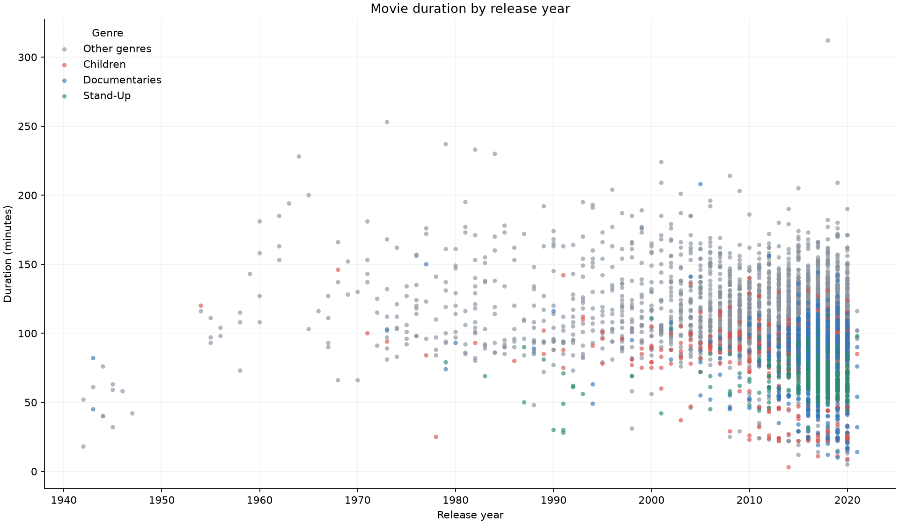

# Netflix Movie Duration Analysis

A Python exploratory data analysis project investigating movie duration by release year, with genre highlighting to help interpret shorter films.

[](https://github.com/1hugemtf/netflix-movie-analysis/actions/workflows/validate.yml)

[Open in Google Colab](https://colab.research.google.com/github/1hugemtf/netflix-movie-analysis/blob/main/notebook.ipynb) · [View notebook](notebook.ipynb)

**Author:** Hamed Dhiaa  
**Tools:** Python, pandas, Matplotlib, Jupyter Notebook

## Project overview

Do movies in this Netflix dataset appear to be getting shorter? This notebook filters the catalogue to movies, identifies titles shorter than 60 minutes, and visualises duration against release year. Children's films, documentaries and stand-up titles are highlighted separately.

This is a learning project from my DataCamp coursework. The notebook builds on the supplied exercise with clearer presentation, data checks and an explicit conclusion. The supplied dataset and illustration are retained. It is not affiliated with Netflix.

## What the notebook does

1. Loads `netflix_data.csv` with pandas.
2. Filters the data to entries labelled `Movie`.
3. Selects title, country, genre, release year and duration.
4. Creates a subset of movies shorter than 60 minutes.
5. Colours Children titles red, Documentaries blue, Stand-Up green and other genres grey, with a visible legend.
6. Plots movie duration against release year.

## Dataset snapshot

- Catalogue entries: **7,787**
- Movie entries: **5,377**
- Movie release years: **1942–2021**
- Movies shorter than 60 minutes: **420**

These figures describe the supplied dataset, not the current Netflix catalogue. For movies, duration is measured in minutes. `release_year` refers to the title's release year; it is distinct from `date_added`.

## Interpretation and limitations

The scatter plot is exploratory: it does not establish that movie runtimes are declining. Genre mix, the number of titles represented in each year, and catalogue selection can affect the apparent pattern. The notebook does not include a statistical trend test or an analysis that controls for genre.

## Preview



GitHub displays the saved notebook and chart; it does not execute Python interactively. Use **Open in Google Colab** above to run it in a browser. In Colab, upload `netflix_data.csv` from this repository using the Files panel, then choose **Runtime → Run all**.

## Run locally

Tested with Python 3.12. The dependency versions used for validation are pinned in `requirements.txt`.

```bash
git clone https://github.com/1hugemtf/netflix-movie-analysis.git
cd netflix-movie-analysis
python -m venv .venv
```

Activate the environment:

```powershell
# Windows PowerShell
.venv\Scripts\Activate.ps1
```

```bash
# macOS / Linux
source .venv/bin/activate
```

Install dependencies and open the notebook:

```bash
python -m pip install -r requirements.txt
python -m jupyterlab notebook.ipynb
```

Run the cells from top to bottom, keeping the CSV and image alongside the notebook.

## Automated validation

```bash
python validate_notebook.py
```

This clears saved outputs, starts a fresh Python kernel, runs every code cell and checks movie counts, filtering, duplicate IDs, plotted point counts, legend labels and chart export. It refreshes the notebook outputs and `movie_duration.png`. GitHub Actions runs the same check on pushes and pull requests; its downloadable artifact contains the executed notebook and chart.

## Files

| File | Purpose |
| --- | --- |
| `notebook.ipynb` | Analysis notebook with freshly executed output |
| `netflix_data.csv` | Supplied catalogue dataset |
| `redpopcorn.jpg` | Supplied notebook illustration |
| `requirements.txt` | Pinned Python dependencies |
| `validate_notebook.py` | Clean execution and result checks |
| `movie_duration.png` | Generated chart preview |
| `.github/workflows/validate.yml` | Automated GitHub check |

## Possible next steps

- Compare annual median and mean movie duration alongside sample sizes.
- Examine trends within genres rather than across the entire catalogue.
- Investigate country coverage and any source-data text quality issues.

## Attribution

This repository contains a DataCamp learning exercise and supplied assets. No blanket open-source licence is applied to the third-party dataset, exercise text or image; their respective rights remain with their owners. Public availability does not establish unrestricted reuse rights.

## Connect

- [Portfolio](https://1huge-dhiaa.carrd.co)
- [LinkedIn](https://www.linkedin.com/in/dhiaa-hamed/)
